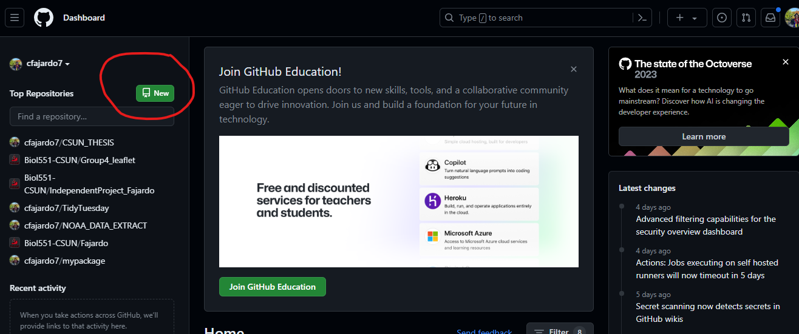
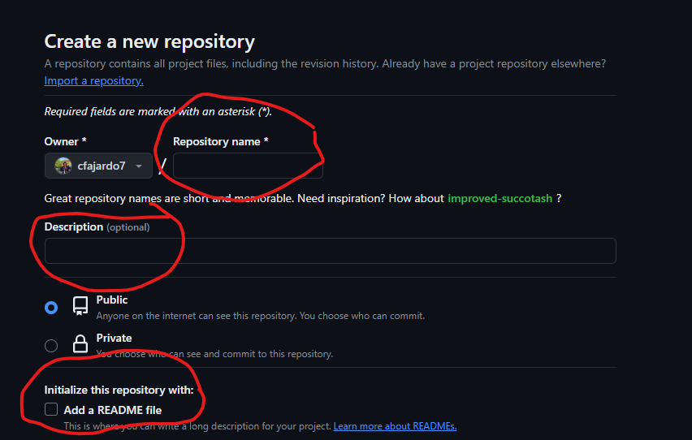
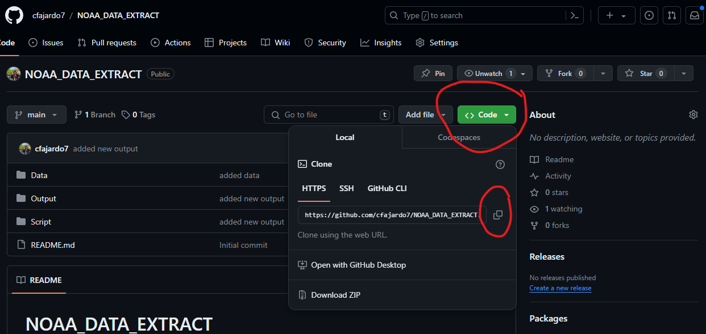
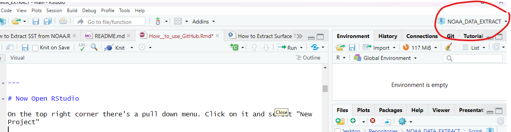
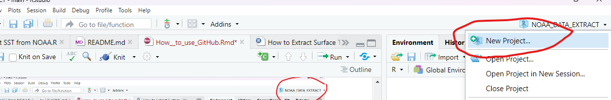
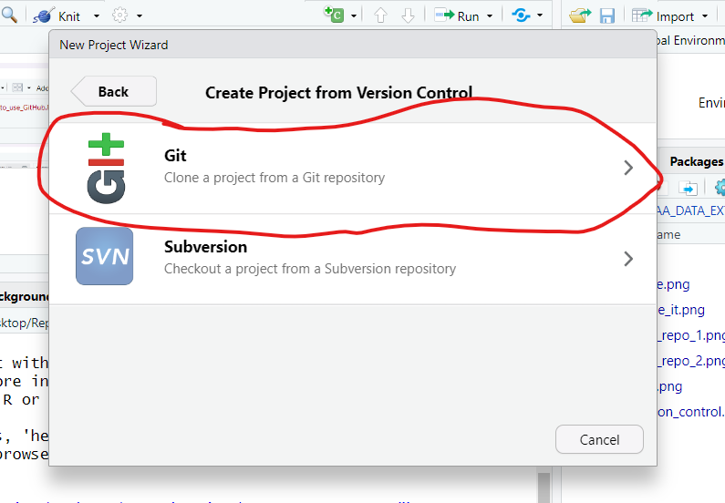
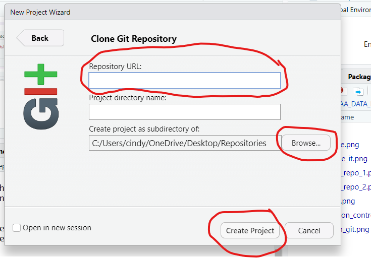
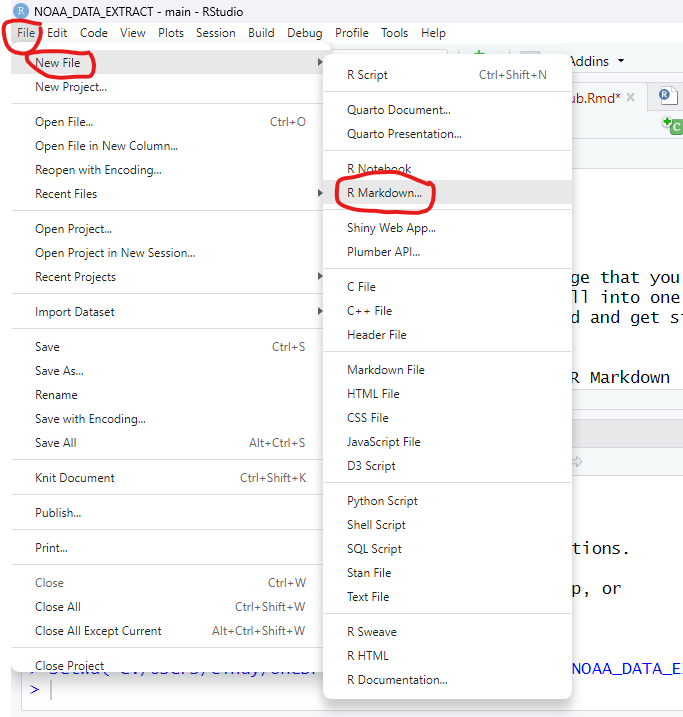
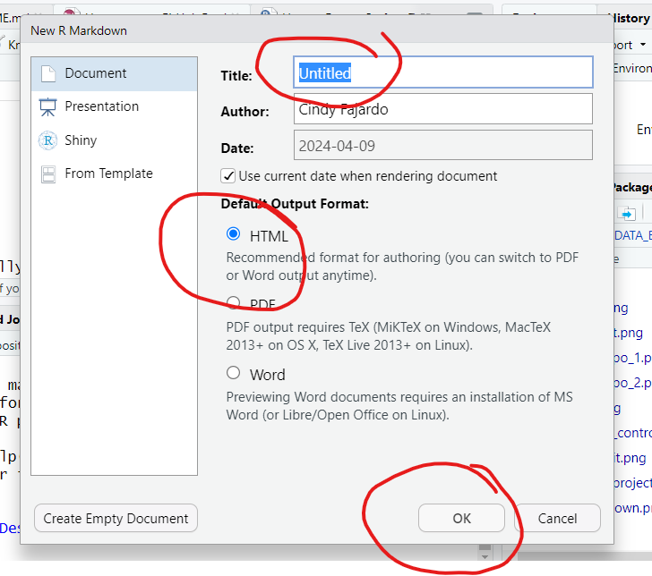
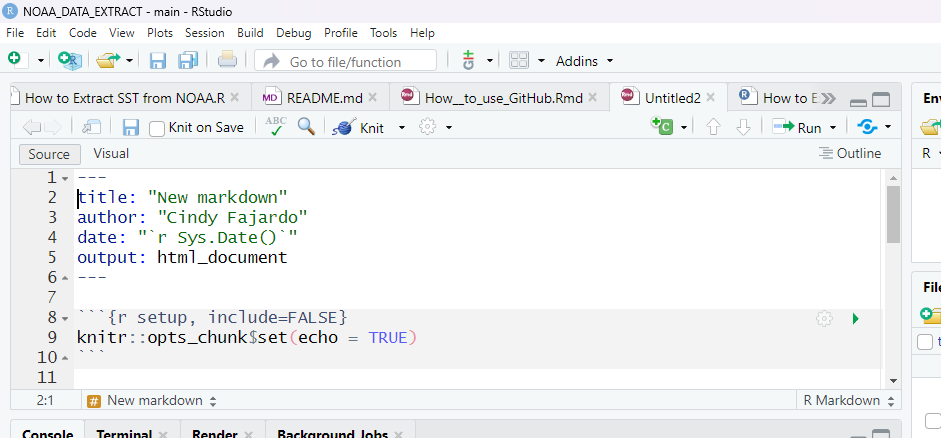

```{r setup, include=FALSE}
options(htmltools.dir.version = FALSE)
```

class: inverse, center, middle

# Lets Get Started

---

# What is Git and what is GitHub
--

**Git**


- Git is a distributed version control system. That means that its a system that brings a copy of a repository from a local source, i.e GitHub, to every ones computer

--

- Once you have a copy of the repository on the device you are working on, you can make changes and commit (save) those changes to the main repository online where other team members can see and download said changes.

--

**GitHub**

- GitHub is a developer platform that allows your to create, share, store, and manage code.

--

- GitHub uses Git software so that you can download a controlled version of the repository for your use


---

# Download Git if you haven't already

For [Windows](https://gitforwindows.org/)

For [MaciOS](https://git-scm.com/download/mac)

---

# Make a GitHub account

- Go to the [GitHub](https://github.com/) webpage and create a GitHub account. 
- If you already have one, then don't worry about this step.

# Now it's time to make a repository!


---

# Making a repo

- On the homepage of GitHub select green button that says "New"


---

# We are going to make a fake repo to test it

--

- Name the repo, it can be test

- Provide a description in the "Description" field

- Click "Add a README file



---

# Now you have an empty repo on GitHub. Now let's bring into R

- Start by "cloning" the repo. You're going to click the green button that says code, then click the clipboard to copy the repo link



---

# Now Open RStudio

On the top right corner there's a pull down menu. Click on it and select "New Project"





---

# Now create a version controlled project
- Select Version Control

---
# Now create a version controlled project
- Select Git



---

# Now create a version controlled project
- In the repository URL field, paste the url that you copied from GitHub
- Select where on your computer it will live (I have a repo folder)
- Click create project


---

class: inverse, center, middle

# You Did It!


---
# Set up for Success
- In your repository you should have 3 separate folders

- Data: where you will store your CSV files

- Output: where all of your figures and any output will go

- Script: where all of your scripts will live

---

# Four commands you MUST use when using a contolled version repo
- Pull [git pull]
- Add [git add]
- Commit [git commit]
- Push [git push]

### These commands helps you to upload all of your data that is stored in your repo on your laptop to GitHub through your terminal!
---

# What are the commands
Pull - This command downloads any changes to your repo from Github. You do this first

Add - This tells git that you are getting ready to add things to the repository. Usually you type it like: git add "(Name of file you are adding)"

Commit - This saves your changes with git. You have to type this with a message i.e git commit -a -m "Updated Script". -a means commit all changes. -m means that you are adding a message

Push - This uploads all of your changes to GitHub


### Now you can use GitHub to upload all of your work! You can work on your data from anywhere that that has access to R and GitHub (in worst case scenerios, if you loose things, yikes)
You can also work directly on GitHub, like adding a RMD file that contains your protocols. But to do that, you need to speak RMarkdown language.

---
class: inverse, center, middle

# RMarkdown

---

# What is RMarkdown

- RMarkdown is an easy to use plain text language that you can use to combine R code, results, graphs, and written comments all into one file. Once you get the hang of it, it is easy to use! Lets go ahead and get started by making an RMarkdown file.

-On the top left corner select file, New file, R Markdown



---

# Give your Markdown a Name



---
# You should have something that looks like this


---
# YAML
In this header, you use YAML, or programming language. Some things are already set up for you like:

title: Will be the new title you just provided

author: Will always be your name

date: The code that is there pulls the days date

output: What type of file you have, in this case, it's an HTML

But in the output, you can change the theme to make it look pretty! Here is a [link](https://rpubs.com/ranydc/rmarkdown_themes) to a cool tutorial to change your theme. There's a whole bunch out there. Just google some!
---

# Chunks

As you scroll through the document, you will see areas with grayed out space that have this configuration ```{r, } . Those are the "chunks" where code goes. The white space is there for you to write anything you would like, but in RMarkdown language. The very first one is the set up chunk. What goes in here sets up the entire document. The keyboard command to make a chunk is  **ctrl+alt+I** or **Cmd + Option + I** (MAC users). I like to use the following:

{r setup, include=FALSE}
knitr::opts_chunk$set(echo = TRUE,
                      warning = FALSE,
                      message = FALSE,
                      fig.path = "../Output/")

- echo = FALSE prevents code, but not the results from appearing in the finished file. This is a useful way to embed figures.

- warning = FALSE prevents warnings that are generated by code from appearing in the finished product.

- message = FALSE prevents messages that are generated by code from appearing in the finished file.

- fig.path = "../Output/" this is telling R that all of the figures that are made from here on out should go into my "Output" folder that is set up in the repo.

---

# Set up your libraries

#Libraries
These are some of the libraries I use. Notice I named my chunk "Libraries", If you don't name your chunk, it will show up as unnamed-chunk in your repo.
```{r, Libraries}
library("rerddap")
library(tidyverse)
library("tidync")
library("doParallel")
library(lubridate)
library(patchwork)
library(viridis)
library(here) #THIS IS IMPORTANT WHEN READING CSV's
library(kableExtra)
library(dplyr)
library(ggplot2)
library(hrbrthemes)
library(emmeans)
library(agricolae)
library(vegan)
library(performance)
library(broom)
library(car)
library(lme4)
library(lmerTest)
``` 

---

# Read in CSV's
Create a new chunk reading in your CSV files. Make sure to name it! Here is how I read in my CSVs

Read in CSV
{r, Read in CSV}

cnm_shell_length <- read_csv(here("Data","2023_09_CNM_OL_SL_Data.csv"))

master_mobiles <- read_csv(here("Data","2023_09_CNM_Mobile_Data.csv"))

fall_cnm_mob_count_mat <- read_csv(here("Data", "2023_09_CNM_Mobile_Count_Matrix.csv"))

---
# Make sure to knit!

On your R console, there is a button that says "Knit" with a ball of yarn. If you select that, R will create your HTML file and produce all of the output you have been creating. Because we did fig.path = "../Output/" in your set up chunk, all of your output should be in your output folder. Give it a try!


---
# Here are some helpful links!
[Learn to write with RMarkdown](https://www.markdowntutorial.com/)

[Writing documents with RMarkdown](https://monashbioinformaticsplatform.github.io/2017-11-16-open-science-training/topics/rmarkdown.html)

[Introduction to RMarkdown](https://rmarkdown.rstudio.com/articles_intro.html)

[Getting Started With RMarkdown](https://ourcodingclub.github.io/tutorials/rmarkdown/)


---

class: center, middle

# Thanks!

Slides created via the R package [**xaringan**](https://github.com/yihui/xaringan).

The chakra comes from [remark.js](https://remarkjs.com), [**knitr**](https://yihui.org/knitr/), and [R Markdown](https://rmarkdown.rstudio.com).
